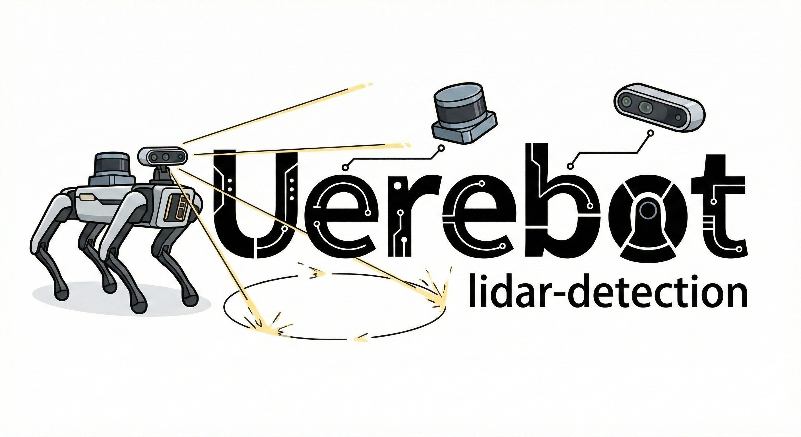

<div align="center">



<p align="center">
  <a href="README.md">English</a> | <a href="README_ZH.md">中文</a>
</p>

[](https://creativecommons.org/licenses/by/4.0/)
[](https://arxiv.org/abs/2602.07363)


</div>


# Overview

> [!NOTE]  
> This Repository is supported for `humble ubuntu 22.04`, more precisely, it has been tested on `x86_64` architecture. For `foxy ubuntu 20.04`(has not been finished yet), please see the `foxy` branch.

This repository contains the implementation of a LiDAR-and-camera-based obstacle detection system. The complete detection system includes a YOLO–RealSense 2D detector and a geometry-based bounding box LiDAR obstacle detector, which is designed to detect and classify obstacles in real time using LiDAR data (currently only supporting **Mid360**) and visual information. All perception-related code and the file structure of four legged robot 'Uerebot' can be found here: [uerebot perception code](https://github.com/XJRCAdmin/lidar_detection).

`./lidar_detection/src/lidarDetection` folder is a ROS 2 package for LiDAR-based obstacle detection, including a Mid360-based LiDAR obstacle detector with the following features:

- Customizable Region of Interest (ROI) for obstacle detection
- Kalman filter for obstacle tracking
- In order to help you tune the parameters to suit your own applications better, all the key parameters of the algorithm are controllable in live action using the ros param in .yaml file.
- Multiple pointcloud filter for noise reduction and outlier removal
- Segmentation of ground plane and obstacle point clouds

And the whole system is shown in the following video:
<div align="center">
  <video src="https://github.com/user-attachments/assets/8f529ec4-a3c2-4c4d-8a57-bd930af39ada" width="100%" controls></video>
</div>

## TODOs
- [ ] A more robust ground segmentation algorithm 
- [ ] Improve foxy branch

# Whole Perception system(This repository)
You can use only lidar_detection package(see `./lidarDetection/src/lidarDetection`) to detect obstacles using LiDAR data , or you can use the whole perception system, which includes both the LiDAR obstacle detection and the YOLO-RealSense 2D detection. Based on our experiments and deployment experience, we adopted a decoupled perception approach that separates LiDAR and camera processing.The two parts are independent of each other, and you can choose to use either one of them or both of them according to your needs.

## Lidar Obstacle Detection Part
```
git clone https://github.com/XJRCAdmin/lidar_detection.git -b humble
cd lidar_detection/lidarDetection
```
And you may need to install some dependencies(rviz2 rqt) like(Specifically, check the dependency errors reported during `colcon build`):
```
sudo apt update
sudo apt install ros-humble-pcl-ros ros-humble-pcl-conversions libpcl-dev
```
Then, you can build the package using the following command:

```
colcon build --symlink-install
ros2 launch lidar_detection go2.launch.py
```
For more information about the lidar obstacle detection part, such as the parameters setting , pipeline and file illustration, please refer to the [lidarDetection README](lidarDetection/README.md).

### rqt Graph


## Yolo-RealSense 2D Detection Part
```
git clone https://github.com/XJRCAdmin/lidar_detection.git -b humble # like the commands above
cd lidar_detection/realsense
git submodule update --init  --recursive # init realsense git repository

cd realsense-ros
git fetch --all --tags
git checkout 4.56.4 # realsense-ros package that supports ros2 humble
```
And you may need to install some dependencies:

Install RealSense SDK 2.0: [link](https://github.com/vanderbiltrobotics/realsense-ros?tab=readme-ov-file#step-2-install-librealsense2)

Also:

```
sudo apt install ros-foxy-rqt-image-view
sudo apt install ros-foxy-sensor-msgs
pip install -r lidar_detection/realsense/yolo_realsense/requirements.txt
```
Then, you can build the package using the following command:
```
colcon build --symlink-install 
```
run the following command to launch the yolo_realsense package:
```
ros2 launch yolo_realsense camera_yolo.launch.py
```
For more information about the yolo_realsense part, such as the parameters setting, please refer to the [yolo_realsense README](./realsense/yolo_realsense/README.md).

## Interface Folder
The message topic interfaces with downstream modules use custom-defined message formats. These formats are specific to the Uerebot project and do not have general reference value.

## Questions and Answers

**Q**: Why not using a fusion scheme that combines LiDAR and camera data for obstacle detection, instead of separating them into two independent pipelines?

**A**: Some reason of separating Lidar and RealSense camera perception parts are as follows:
- Due to computational bottlenecks on the edge computing platform and stringent real-time system requirements(Nvidia Jetson), the overall perception frame rate (FPS) experienced an unacceptable degradation. In addition, message buffer queue management and timestamp synchronization became problematic.
- The quadruped robot’s inherent high-frequency vibrations, together with reflection-induced artifacts, led to odometry drift in FAST-LIO and Point-LIO (i.e., point cloud drift), which in turn caused fusion-based registration to fail and resulted in spatial misalignment.
- The cost-effectiveness of perception FOV was also a key consideration. Although the Mid360 provides full 360° coverage, the forward-facing RealSense camera offers only about 80°–90° horizontal FOV. A fusion scheme would therefore deliver high-confidence data only in the frontal sector, while the remaining 270° still requires an independent LiDAR-only geometric pipeline. This hybrid “semi-fusion, semi-decoupled” architecture imposes additional computational overhead on edge devices—running YOLO, a forward fusion node, and a separate omnidirectional LiDAR thread simultaneously. Instead of maintaining such a fragmented system, a fully decoupled design that maximizes the Mid360’s omnidirectional geometric advantages is more efficient and pragmatic.

**Q**:Why not using learning based LiDAR detection methods?

**A**: While learning-based 3D LiDAR detection methods (such as PointPillars or CenterPoint) show state-of-the-art performance on autonomous driving benchmarks, deploying them on a legged robot like Uerebot introduces significant domain gaps and engineering bottlenecks.
First, models trained on datasets like KITTI or nuScenes heavily overfit to the horizontal scan patterns of roof-mounted spinning LiDARs. They struggle to generalize to the non-repetitive, dense rosette scanning pattern and the low-to-the-ground viewpoint of the Livox Mid360.
Second, learning-based methods are typically closed-set, focusing on predefined classes (cars, pedestrians). Our quadruped needs to avoid open-world, irregular geometric obstacles (e.g., rocks, scattered boxes, low steps).

## Development Log 
- [lidarDetection README](lidarDetection/README.md)
- [CHANGELOG](lidarDetection/CHANGELOG.md)
- [yolo_realsense README](realsense/yolo_realsense/README.md)

# Acknowledgement
- [lidar_obstacle_detector](https://github.com/SS47816/lidar_obstacle_detector)
