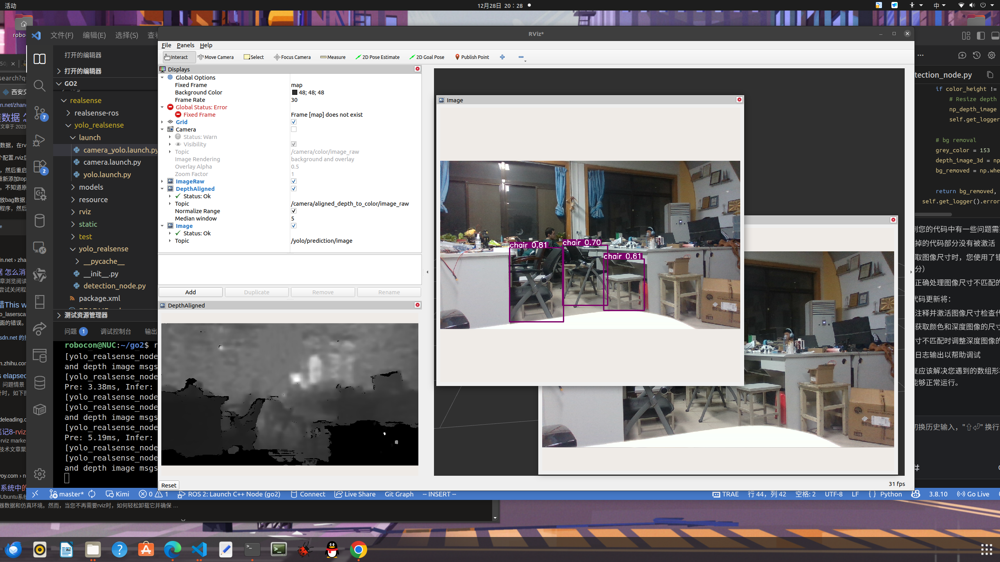
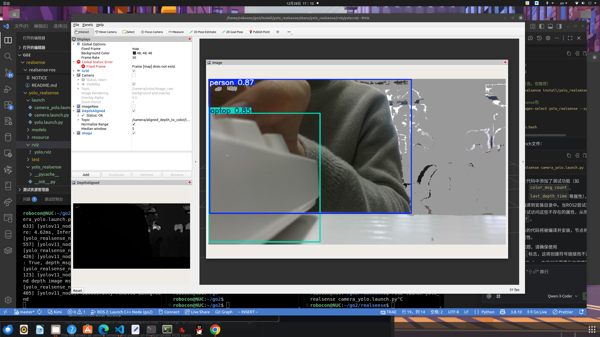

# YOLO + RealSense D435i ROS2 node

首先安装[realsense sdk2](https://github.com/vanderbiltrobotics/realsense-ros?tab=readme-ov-file#step-2-install-librealsense2).


```
克隆本仓库: git clone xxx
git submodule update --init --recursive  # clone realsense-ros子模块
```


## 重要:Foxy 不被realsense-ros最新支持版本支持，需切换4.0.4版本：
```
git fetch --all --tags
# 切换到 4.0.4 或更早版本，这是支持 Foxy 的最后一个稳定大版本
git checkout 4.0.4
```

# 依赖
一些依赖:
```
sudo apt install ros-foxy-rqt-image-view
sudo apt install ros-foxy-sensor-msgs
pip install -r requirements.txt
```

# run realsense + yolo detector
```
ros2 launch yolo_realsense camera_yolo.launch.py
```
如果要修改参数,一部分在launch文件中,另一部分在`detection_node.py`的`Node __init__`中,可以声明去除背景与否.

纯yolo.pt文件,推理用时:
```
[yolo_realsense_node-2] [INFO] [1766913026.079859364] [yolov11_node]: YOLO Time: Total 161.84ms (Pre: 3.01ms, Infer: 157.29ms, Post: 1.54ms)
```
ONNX(Open Neural Network Exchange)是一种开放的标准化文件格式，专门用于存储和交换训练好的机器学习模型，尤其是深度学习模型。它的核心目标是实现不同框架（如PyTorch、TensorFlow等）之间的模型互操作性，简化模型的跨平台部署和优化。

onnx中间模型,推理用时:

```
[yolo_realsense_node-2] [INFO] [1766918562.390098225] [yolov11_node]: YOLO Time: Total 119.22ms (Pre: 9.91ms, Infer: 107.64ms, Post: 1.67ms)
```

根据推理引擎的不同可以进一步优化推理速度，比如使用OpenVINO、TensorRT等。由于当前的主机并非Jetson Orin/xavier NX,因而选择将模型保留到onnx这一步,后续可以在进行优化(转一下模型格式即可).在intel NUC上将模型量化为`.bin .xml`格式时,推理速度可以达到50ms以内.

图片通过rivz2显示,如下(有时会出现rviz的段错误退出,可以在launch文件中先注释掉rviz节点,再另起一个终端rviz2):

